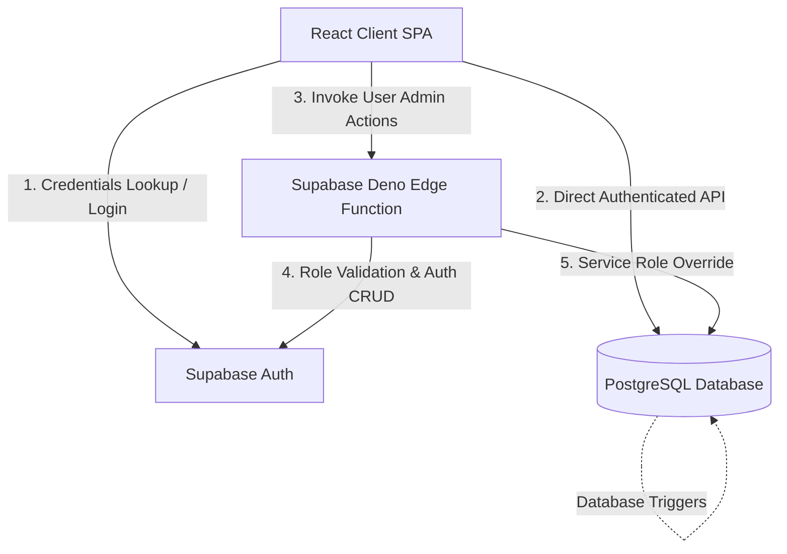
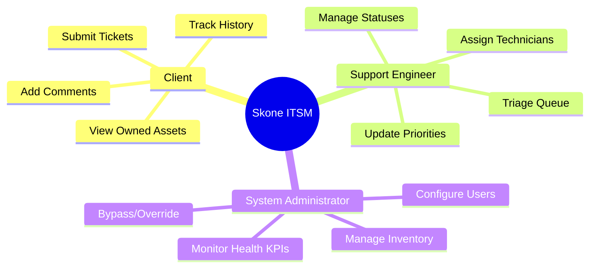
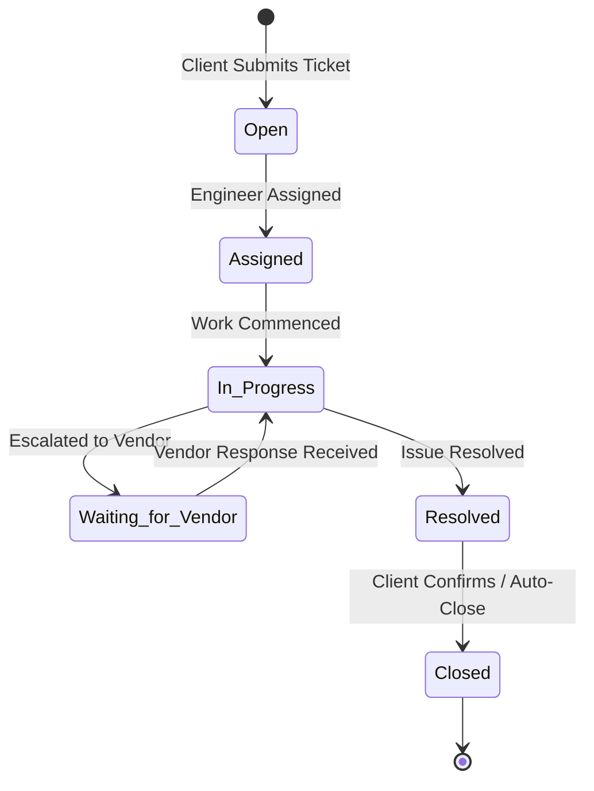
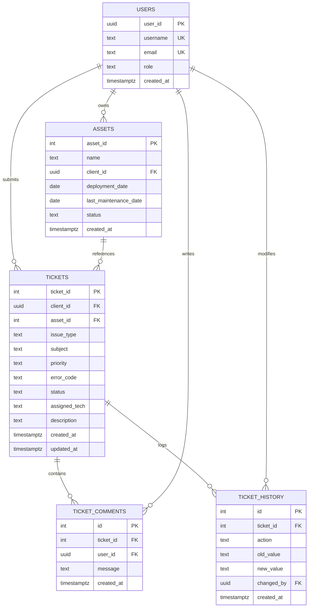

# ⚡ Skone Tech Support Ticketing & Asset Tracking

A high-performance, secure, and role-based IT service desk and asset tracking solution built on a serverless **Supabase** backend paired with a dynamic **React** dashboard.

<div align="center">

[](https://react.dev/)
[](https://supabase.com/)
[](https://www.postgresql.org/)
[](https://deno.land/)

</div>

---

## 🗺️ System Architecture

The following block showcases the direct interaction layer between the single-page application client, Supabase backend databases, security validation engines, and serverless compute edge functions:



---

## 👥 Role-Based Workflows & Capabilities

The platform operates on a granular three-tier role access design. Each role has separate operational boundaries, automated workflows, and workspace interfaces:



### 👤 Client Portal
- **Interactive Ticket Creation**: Raise tickets with custom priorities (`Low`, `Medium`, `High`, `Critical`), error codes, and links to assigned hardware.
- **Timeline Audit Logs**: View automated history logs showing exactly who updated their ticket and when.
- **Collaborative Comments**: Chat directly with support engineers inside the ticket view.
- **Inventory Overview**: View a live register of issued hardware or software configurations.

### 🛠️ Support Workspace
- **Advanced Triage Queues**: Sort, filter, and paginate tickets across `My Queue`, `Open Queue`, and `Closed Queue` folders.
- **Interactive Triage Board**: Update assignees, change priorities, and alter statuses in real time.
- **Communication Hub**: Drop notes or replies to keep the client updated.

### 👑 Administrator Console
- **Deno User provisioning**: Provision, update, or decommission users safely through serverless Edge Functions.
- **Asset Control Center**: Perform CRUD operations on global hardware inventory.
- **KPI Metrics Dashboard**: Track system operational statuses (e.g., active backlogs, pending triages, resolved tickets count).

---

## 🔄 Ticket Lifecycle Flowchart

The system validates all status transitions to guarantee data consistency. Below is the workflow diagram:



---

## 🗄️ Relational Database Schema

The database relies on PostgreSQL foreign keys and constraints to maintain referential integrity.

### Entity Relationship Model



### Table Definitions & Access Policies

<details>
<summary><b>1. users (Profile Sync Table)</b></summary>

Maps users securely between authentication records and public tables.
* **Row Level Security (RLS)**:
  * Select: Authenticated users can view their own profiles; Support/Admins can view all profiles.
  * Write (Insert/Update/Delete): Restrained entirely to system Administrators.

| Column Name | Data Type | Modifiers / Constraints |
| :--- | :--- | :--- |
| `user_id` | `UUID` | `PRIMARY KEY REFERENCES auth.users(id) ON DELETE CASCADE` |
| `username` | `TEXT` | `UNIQUE NOT NULL` |
| `email` | `TEXT` | `UNIQUE NOT NULL` |
| `role` | `TEXT` | `NOT NULL DEFAULT 'Client' CHECK (role IN ('Client', 'Support Engineer', 'Admin'))` |
| `created_at` | `TIMESTAMPTZ` | `NOT NULL DEFAULT NOW()` |
</details>

<details>
<summary><b>2. assets (Inventory Management)</b></summary>

Maintains the catalog of company assets assigned to clients.
* **Row Level Security (RLS)**:
  * Select: Clients can view their own assets; Support/Admins can view all assets.
  * Write: Restrained entirely to system Administrators.

| Column Name | Data Type | Modifiers / Constraints |
| :--- | :--- | :--- |
| `asset_id` | `SERIAL` | `PRIMARY KEY` |
| `name` | `TEXT` | `NOT NULL` |
| `client_id` | `UUID` | `NOT NULL REFERENCES public.users(user_id) ON DELETE CASCADE` |
| `deployment_date` | `DATE` | Optional |
| `last_maintenance_date`| `DATE` | Optional |
| `status` | `TEXT` | `NOT NULL DEFAULT 'Active' CHECK (status IN ('Active', 'In Repair', 'Decommissioned'))` |
| `created_at` | `TIMESTAMPTZ` | `NOT NULL DEFAULT NOW()` |
</details>

<details>
<summary><b>3. tickets (Service Backlog)</b></summary>

Core model tracking user issues, triages, and engineering progression.
* **Row Level Security (RLS)**:
  * Select: Clients can view their own tickets; Support/Admins can view all tickets.
  * Insert: Restricted to authenticated users holding the `Client` role.
  * Update: Restricted to Support Engineers and Administrators.

| Column Name | Data Type | Modifiers / Constraints |
| :--- | :--- | :--- |
| `ticket_id` | `SERIAL` | `PRIMARY KEY` |
| `client_id` | `UUID` | `NOT NULL REFERENCES public.users(user_id) ON DELETE CASCADE` |
| `asset_id` | `INT` | `REFERENCES public.assets(asset_id) ON DELETE SET NULL` |
| `issue_type` | `TEXT` | `NOT NULL` |
| `subject` | `TEXT` | `DEFAULT ''` |
| `priority` | `TEXT` | `NOT NULL DEFAULT 'Low' CHECK (priority IN ('Low', 'Medium', 'High', 'Critical'))` |
| `error_code` | `TEXT` | Optional |
| `status` | `TEXT` | `NOT NULL DEFAULT 'Open' CHECK (status IN ('Open', 'Assigned', 'In Progress', 'Resolved', 'Closed', 'Waiting for Vendor'))` |
| `assigned_tech` | `TEXT` | Optional |
| `description` | `TEXT` | `NOT NULL` |
| `created_at` | `TIMESTAMPTZ` | `NOT NULL DEFAULT NOW()` |
| `updated_at` | `TIMESTAMPTZ` | `NOT NULL DEFAULT NOW()` |
</details>

<details>
<summary><b>4. ticket_comments (Communication Thread)</b></summary>

Maintains communication history on tickets.
* **Row Level Security (RLS)**:
  * Select: Users can view comments if they are Support/Admins or the client who opened the ticket.
  * Insert: Users can add comments if they are Support/Admins or the client who opened the ticket.

| Column Name | Data Type | Modifiers / Constraints |
| :--- | :--- | :--- |
| `id` | `SERIAL` | `PRIMARY KEY` |
| `ticket_id` | `INT` | `NOT NULL REFERENCES public.tickets(ticket_id) ON DELETE CASCADE` |
| `user_id` | `UUID` | `NOT NULL REFERENCES public.users(user_id) ON DELETE CASCADE` |
| `message` | `TEXT` | `NOT NULL` |
| `created_at` | `TIMESTAMPTZ` | `NOT NULL DEFAULT NOW()` |
</details>

<details>
<summary><b>5. ticket_history (Automated Audit Logs)</b></summary>

Stores change logs for ticket triaging events.
* **Row Level Security (RLS)**:
  * Select: Users can view history if they are Support/Admins or the client who opened the ticket.
  * Write: Disabled (inserts are handled via backend database trigger on ticket updates).

| Column Name | Data Type | Modifiers / Constraints |
| :--- | :--- | :--- |
| `id` | `SERIAL` | `PRIMARY KEY` |
| `ticket_id` | `INT` | `NOT NULL REFERENCES public.tickets(ticket_id) ON DELETE CASCADE` |
| `action` | `TEXT` | `NOT NULL` |
| `old_value` | `TEXT` | Optional |
| `new_value` | `TEXT` | Optional |
| `changed_by` | `UUID` | `NOT NULL REFERENCES public.users(user_id) ON DELETE CASCADE` |
| `created_at` | `TIMESTAMPTZ` | `NOT NULL DEFAULT NOW()` |
</details>

---

## 🛠️ Technical Highlights

Here are key patterns implemented to secure operations and guarantee performance:

### 🛡️ RLS Recursion Bypass
> [!IMPORTANT]
> Querying the `public.users` table inside an RLS policy for `public.users` can trigger infinite recursion. We bypass this using a lightweight `SECURITY DEFINER` function that queries roles directly:

```sql
CREATE OR REPLACE FUNCTION public.check_user_in_roles(p_roles TEXT[])
RETURNS BOOLEAN AS $$
BEGIN
  RETURN EXISTS (
    SELECT 1 FROM public.users
    WHERE user_id = auth.uid() AND role = ANY(p_roles)
  );
END;
$$ LANGUAGE plpgsql SECURITY DEFINER;
```

### 📋 Automatic Audit Logging Trigger
Every time a ticket status, assignee, or priority is modified, a trigger fires to insert record updates into `ticket_history`:

```sql
CREATE OR REPLACE FUNCTION public.log_ticket_history()
RETURNS TRIGGER AS $$
DECLARE
  v_changed_by UUID;
BEGIN
  v_changed_by := auth.uid();
  IF v_changed_by IS NULL THEN
    v_changed_by := NEW.client_id;
  END IF;

  -- Status update log
  IF OLD.status IS DISTINCT FROM NEW.status THEN
    INSERT INTO public.ticket_history (ticket_id, action, old_value, new_value, changed_by)
    VALUES (NEW.ticket_id, 'Status Update', OLD.status, NEW.status, v_changed_by);
  END IF;
  
  -- Additional change checks (assigned_tech, priority)...
  RETURN NEW;
END;
$$ LANGUAGE plpgsql SECURITY DEFINER;
```

### ⚡ User Administration Edge Function
Administrators manage system users via an isolated Supabase Edge Function (`supabase/functions/manage-users/index.ts`). The function validates authorization using Deno and uses the elevated `service_role` client to bypass RLS and perform user CRUD operations.

---

## 🚀 Local Development Setup

### Prerequisites
- Node.js (v18+)
- NPM
- A Supabase project instance (local or hosted)

### 1. Environment Config
Create a `.env` file inside the `frontend/` directory:
```env
REACT_APP_SUPABASE_URL=https://your-project-id.supabase.co
REACT_APP_SUPABASE_ANON_KEY=eyJhbGciOiJIUzI1NiIsInR5cCI6IkpXVCJ9...
```

### 2. Package Setup
Run the following commands in your terminal to install packages and configurations:
```bash
# Install root utility modules
npm install

# Run installer script for frontend packages
npm run install-all
```

### 3. Run Developer Server
Start the frontend development hot-reload server locally:
```bash
npm start
```
Your browser will open to `http://localhost:3000`.

---

## 🧪 Integration Verification

To test backend connections, execute the integrated verification script:

```bash
cd frontend
node verify.js
```
The script validates username-to-email query resolution (`get_email_by_username`), database access, and Supabase Auth credentials.

---

## 🔑 Managing Multiple GitHub Accounts (Git 403 Errors)

If you have multiple GitHub accounts configured on your local system (e.g. `raosahil0` and `sahilyadav-01`) and encounter authentication denials during operations:

```text
remote: Permission to sahilyadav-01/skone-ticketing-platform.git denied to raosahil0.
fatal: unable to access 'https://github.com/sahilyadav-01/skone-ticketing-platform.git/': The requested URL returned error: 403
```

You can configure Git to target and isolate the `sahilyadav-01` login profile:

### 1. Update the Remote URL
Include the target username prefix `sahilyadav-01@` in your remote HTTPS configurations:
```bash
git remote set-url origin https://sahilyadav-01@github.com/sahilyadav-01/skone-ticketing-platform.git
git remote set-url upstream https://sahilyadav-01@github.com/sahilyadav-01/skone-ticketing-platform.git
```

### 2. Flush Old Cached Credentials
If Git continues to try the wrong cached session, clear it from the credential helper:
```bash
"url=https://github.com" | git credential reject
```

### 3. Push and Authenticate
Execute your next remote push command:
```bash
git push origin revamp
```
Git Credential Manager will launch a login dialog scoped specifically to `sahilyadav-01`, isolating your credentials without affecting global mappings.

