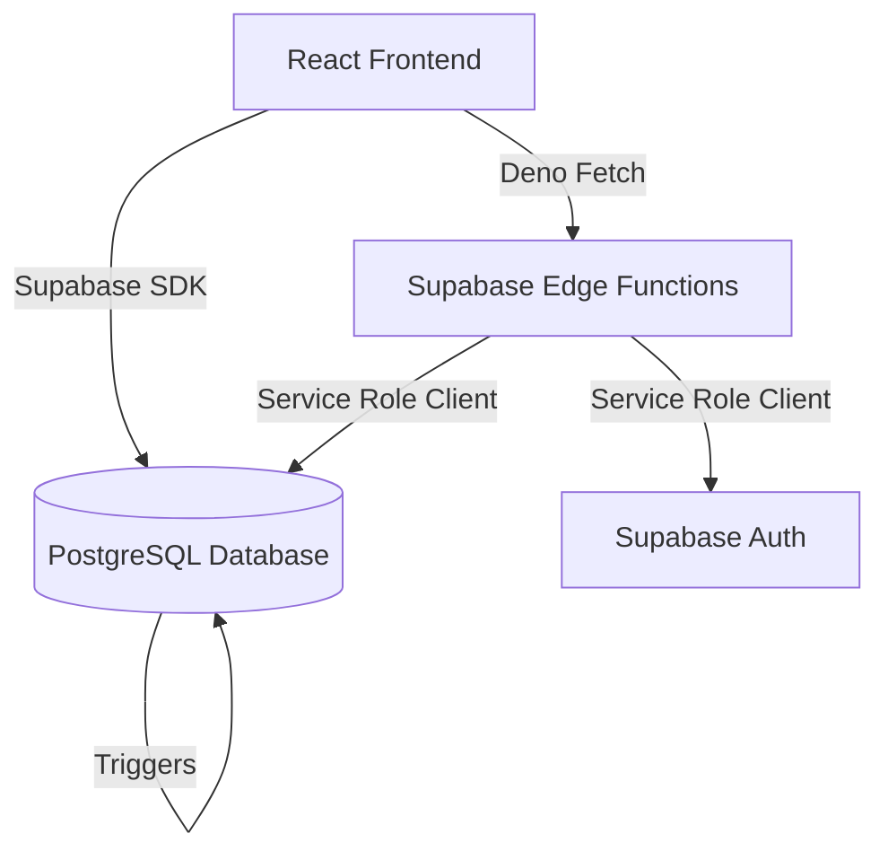

# Skone Tech Support Ticketing & Asset Tracking

[](https://react.dev/)
[](https://supabase.com/)
[](https://www.postgresql.org/)
[](https://deno.land/)

A modern, secure, role-based IT Tech Support Ticketing & Asset Tracking platform. The system supports full ticket lifecycles, real-time activity/audit logging, asset assignments, and user administration, built on a serverless **Supabase** backend with a dynamic **React** client.

---

## Table of Contents

- [Features & Workflows](#features--workflows)
  - [Client Workflow](#client-workflow)
  - [Support Engineer Workflow](#support-engineer-workflow)
  - [Administrator Workflow](#administrator-workflow)
- [Architecture & Tech Stack](#architecture--tech-stack)
- [Database Schema](#database-schema)
  - [Tables & Fields](#tables--fields)
  - [Row Level Security (RLS) Policies](#row-level-security-rls-policies)
  - [Database Triggers & Functions](#database-triggers--functions)
- [Edge Functions](#edge-functions)
- [Frontend Structure](#frontend-structure)
- [Local Development Setup](#local-development-setup)
  - [1. Clone and Install Dependencies](#1-clone-and-install-dependencies)
  - [2. Environment Configuration](#2-environment-configuration)
  - [3. Start the Application](#3-start-the-application)
- [Verification & Connectivity Testing](#verification--connectivity-testing)

---

## Features & Workflows

### Client Workflow
- **Ticket Submission**: Create technical support tickets containing subject, description, issue type, priority level, error code, and associated asset.
- **Asset Monitoring**: View all hardware/software assets assigned directly to them.
- **Interactive Ticket Activity**: Add comments to their own tickets and view live agent comments.
- **Audit History**: Access the complete change log (status updates, technician assignments, etc.) of their own tickets.

### Support Engineer Workflow
- **Workspace Dashboard**: Access specialized ticket queues (Open, Assigned, Closed, and My Queue) to track daily caseloads.
- **Ticket Lifecycle Management**: Triage tickets by assigning engineers, updating priority levels, and changing status (`Open`, `Assigned`, `In Progress`, `Waiting for Vendor`, `Resolved`, `Closed`).
- **Communication Hub**: Exchange real-time communication with clients using comment threads.
- **SLA Tracking**: Monitor tickets requiring attention based on priority.

### Administrator Workflow
- **User Management**: Perform secure CRUD operations (create, update, delete) on system users and roles via admin panel.
- **Asset Administration**: Manage the company's asset inventory (create, assign to users, modify status, and retire assets).
- **System Metrics**: Access analytical indicators such as ticket summary metrics (open tickets, pending tickets, and tickets resolved today).

---

## Architecture & Tech Stack



- **Frontend Client**: SPA written in React 18, using Vanilla CSS for state-of-the-art styling, custom React hooks (`useAuth` and `useTickets`) for clean separation of UI and state, and direct integration with Supabase JS SDK.
- **Database Backend**: Managed PostgreSQL instance on Supabase featuring custom SQL functions, RPC endpoints, performance indexes, and strict Row Level Security (RLS) policies.
- **Auth Provider**: Supabase Auth handling secure sign-ins, credentials lookup (email-by-username), and session token validation.
- **Edge Computing (Serverless)**: Deno-powered Supabase Edge Functions for handling administrative operations safely away from client-side execution limits.

---

## Database Schema

The system layout is fully normalized to guarantee consistency, referential integrity, and performant operations.

### Tables & Fields

#### 1. `public.users`
Stores user profile information synced securely from `auth.users`.
| Column Name | Data Type | Constraints / Default | Description |
| :--- | :--- | :--- | :--- |
| `user_id` | `UUID` | `PRIMARY KEY`, `REFERENCES auth.users(id)` | Matches the unique Supabase auth identifier. |
| `username` | `TEXT` | `UNIQUE`, `NOT NULL` | User identifier used for logging in. |
| `email` | `TEXT` | `UNIQUE`, `NOT NULL` | Standard communication email. |
| `role` | `TEXT` | `NOT NULL`, `CHECK (role IN ('Client', 'Support Engineer', 'Admin'))`, Default `'Client'` | Determines UI dashboards and RLS policy access. |
| `created_at`| `TIMESTAMPTZ` | Default `NOW()` | Timestamp when the user was synchronized. |

#### 2. `public.assets`
Stores company assets assigned to clients.
| Column Name | Data Type | Constraints / Default | Description |
| :--- | :--- | :--- | :--- |
| `asset_id` | `SERIAL` | `PRIMARY KEY` | Auto-incrementing identifier. |
| `name` | `TEXT` | `NOT NULL` | Asset identifier (e.g., "MacBook Pro 16"). |
| `client_id` | `UUID` | `NOT NULL`, `REFERENCES public.users(user_id)` | Owner of the asset. |
| `deployment_date` | `DATE` | Optional | Date asset was issued. |
| `last_maintenance_date` | `DATE` | Optional | Last maintenance review date. |
| `status` | `TEXT` | `CHECK (status IN ('Active', 'In Repair', 'Decommissioned'))`, Default `'Active'` | Current operational state. |
| `created_at` | `TIMESTAMPTZ` | Default `NOW()` | Timestamp when asset was logged. |

#### 3. `public.tickets`
Core entity tracking support requests.
| Column Name | Data Type | Constraints / Default | Description |
| :--- | :--- | :--- | :--- |
| `ticket_id` | `SERIAL` | `PRIMARY KEY` | Auto-incrementing ticket number. |
| `client_id` | `UUID` | `NOT NULL`, `REFERENCES public.users(user_id)` | User who opened the ticket. |
| `asset_id` | `INT` | `REFERENCES public.assets(asset_id)`, Set Null on Delete | Optional hardware/software asset relevant to the issue. |
| `issue_type` | `TEXT` | `NOT NULL` | Category (e.g., Hardware, Software, Network). |
| `subject` | `TEXT` | Default `''` | Summary of the issue. |
| `priority` | `TEXT` | `CHECK (priority IN ('Low', 'Medium', 'High', 'Critical'))`, Default `'Low'` | SLA Urgency level. |
| `error_code` | `TEXT` | Optional | Debugging code if available. |
| `status` | `TEXT` | `CHECK (status IN ('Open', 'Assigned', 'In Progress', 'Resolved', 'Closed', 'Waiting for Vendor'))`, Default `'Open'` | Lifecycle progression. |
| `assigned_tech`| `TEXT` | Optional | Name of the assigned Support Engineer. |
| `description`| `TEXT` | `NOT NULL` | Comprehensive description of the issue. |
| `created_at` | `TIMESTAMPTZ` | Default `NOW()` | Creation timestamp. |
| `updated_at` | `TIMESTAMPTZ` | Default `NOW()` | Updated automatically on edits. |

#### 4. `public.ticket_comments`
Tracks messaging updates on tickets.
| Column Name | Data Type | Constraints / Default | Description |
| :--- | :--- | :--- | :--- |
| `id` | `SERIAL` | `PRIMARY KEY` | Comment identifier. |
| `ticket_id` | `INT` | `NOT NULL`, `REFERENCES public.tickets(ticket_id)` | Related ticket. |
| `user_id` | `UUID` | `NOT NULL`, `REFERENCES public.users(user_id)` | Creator of the message. |
| `message` | `TEXT` | `NOT NULL` | Rich text/plain text message content. |
| `created_at` | `TIMESTAMPTZ` | Default `NOW()` | Timestamp of post. |

#### 5. `public.ticket_history`
Audit logs capturing ticket updates automatically.
| Column Name | Data Type | Constraints / Default | Description |
| :--- | :--- | :--- | :--- |
| `id` | `SERIAL` | `PRIMARY KEY` | History entry identifier. |
| `ticket_id` | `INT` | `NOT NULL`, `REFERENCES public.tickets(ticket_id)` | Tracked ticket. |
| `action` | `TEXT` | `NOT NULL` | Logged event name (e.g., 'Status Update'). |
| `old_value` | `TEXT` | Optional | Old state. |
| `new_value` | `TEXT` | Optional | New state. |
| `changed_by` | `UUID` | `NOT NULL`, `REFERENCES public.users(user_id)` | User who made the adjustment. |
| `created_at` | `TIMESTAMPTZ` | Default `NOW()` | Execution timestamp. |

---

### Row Level Security (RLS) Policies

To protect database operations against unauthorized requests, RLS is enabled on all tables:

1. **`users` Table**:
   - `Allow read access to authenticated users`: A user can read their own profile, or engineers/admins can view all user profiles.
   - `Allow write access to Admins`: Only Admins can modify profile table columns (insert, update, delete).
2. **`assets` Table**:
   - `Allow users to read their own assets`: Clients can only query assets issued to their profile. Support engineers and admins can query all assets.
   - `Allow Admins to manage assets`: Only Admins can insert or update asset logs.
3. **`tickets` Table**:
   - `Allow users to read their own tickets`: Clients can only read their tickets; Support/Admins can read all tickets.
   - `Allow clients to create tickets`: Only authenticated clients can submit tickets matching their own user ID.
   - `Allow support and admins to update tickets`: Restricts ticket triaging to Support Engineers and Admins.
4. **`ticket_comments` Table**:
   - `Allow read access to ticket comments`: Authorized if the user is Support/Admin, or if they own the ticket the comment belongs to.
   - `Allow insert access to ticket comments`: Engineers/Admins can comment anywhere; clients can only comment on their own tickets.
5. **`ticket_history` Table**:
   - `Allow read access to ticket history`: Restricts history logs to Support/Admins or the owner client of the corresponding ticket.

---

### Database Triggers & Functions

- **`check_user_in_roles(p_roles TEXT[])`**: Helper function with `SECURITY DEFINER` privileges checking if `auth.uid()` has any of the requested roles. Used to bypass standard RLS recursion issues.
- **`get_email_by_username(p_username TEXT)`**: Secure pre-login username-to-email resolver. Allows users to enter their simple username on login; the frontend resolves it to their authentication email to call the standard Supabase signIn API.
- **`get_ticket_summary(p_client_id UUID)`**: Aggregates ticket statuses dynamically, counting open, pending, and today-resolved tickets. Automatically restricts client data requests to their own tickets.
- **`handle_new_user()` & `handle_update_user()`**: Listens to `auth.users` changes. Creates or updates profile references in `public.users` instantly. Sets the default role to `Client` on registration for security purposes.
- **`log_ticket_history()`**: Listens to updates on `public.tickets`. Logs updates to `ticket_history` automatically whenever `status`, `assigned_tech`, or `priority` updates.

---

## Edge Functions

The `manage-users` serverless Edge Function performs user management:
- **Location**: `supabase/functions/manage-users/index.ts`
- **Actions supported**:
  - `create`: Provisions a new account with the requested username, password, email, and security role.
  - `update`: Modifies attributes (email, password, role) of an existing user account.
  - `delete`: Safely removes the user account from Auth and public profiles.
- **Security Check**: Before execution, the function verifies the user session token in the request header, queries `public.users` to confirm the sender holds the `Admin` role, and then utilizes the elevated `service_role` client to perform administrative auth functions.

---

## Frontend Structure

The client application separates page views, components, and state:
- `src/App.js`: Top-level router routing authenticated views, search terms, and layouts.
- `src/components/`:
  - `TicketForm.js` / `TicketList.js` / `TicketCard.js`: Handles creation, listing, sorting, and display of tickets.
  - `Sidebar.js`: Dynamic role-based navigation sidebar.
  - `AssetFormFields.js` / `StatusBadge.js` / `Modal.js`: Resilient reusable UI parts.
- `src/pages/`:
  - `Dashboard.js`: KPI analytics panels.
  - `TicketQueueWorkspace.js`: Interactive engineer workspace with triage tools, history, and comment modules.
  - `AssetsView.js` / `AdminUsers.js`: Administrative asset inventory and user lists.
  - `LoginReal.js` / `Reports.js` / `Settings.js`: Interface layers for auth and configs.
- `src/hooks/`:
  - `useAuth.js`: Handles session checks, pre-login lookup, sign-ins, storage cache, and logouts.
  - `useTickets.js`: Encapsulates search inputs, page parameters, creation requests, and ticket updates.

---

## Local Development Setup

### 1. Clone and Install Dependencies

Install root dependencies and frontend dependencies:

```bash
# Install root script runner (concurrently)
npm install

# Install React dependencies inside frontend folder
npm run install-all
```

### 2. Environment Configuration

Create a `.env` file inside the `frontend/` directory:

```env
REACT_APP_SUPABASE_URL=https://your-project-ref.supabase.co
REACT_APP_SUPABASE_ANON_KEY=your-supabase-anonymous-key
```

### 3. Start the Application

Start the React local development server:

```bash
npm start
```
This launches the application on `http://localhost:3000`.

---

## Verification & Connectivity Testing

To quickly test connectivity, database permissions, and authentication mechanisms, run the verification script from the frontend folder:

```bash
cd frontend
node verify.js
```
This tests username lookup resolution (`get_email_by_username`), database query response, and user auth sign-in parameters.
